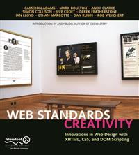

#Apress Source Code

This repository accompanies [*Web Standards Creativity*](http://www.apress.com/9781590598030) by Andy Budd, Rob Weychert, Dan Rubin, Ian Lloyd, Derek Featherstone, Jeffrey Croft, Andy Clarke, Mark Boulton, Cameron Adams, and Simon Collison (Apress, 2007).

Download the files as a zip using the green button, or clone the repository to your machine using Git.

##Releases

Release v1.0 corresponds to the code in the published book, without corrections or updates.

##Contributions

See the file Contributing.md for more information on how you can contribute to this repository.
